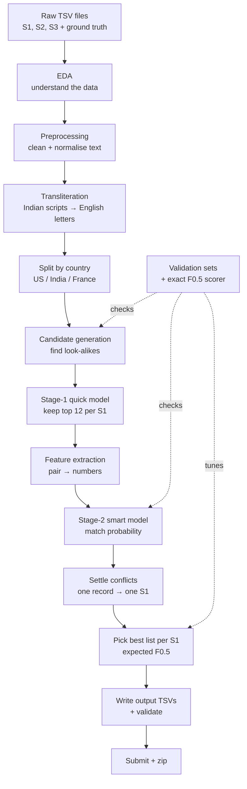
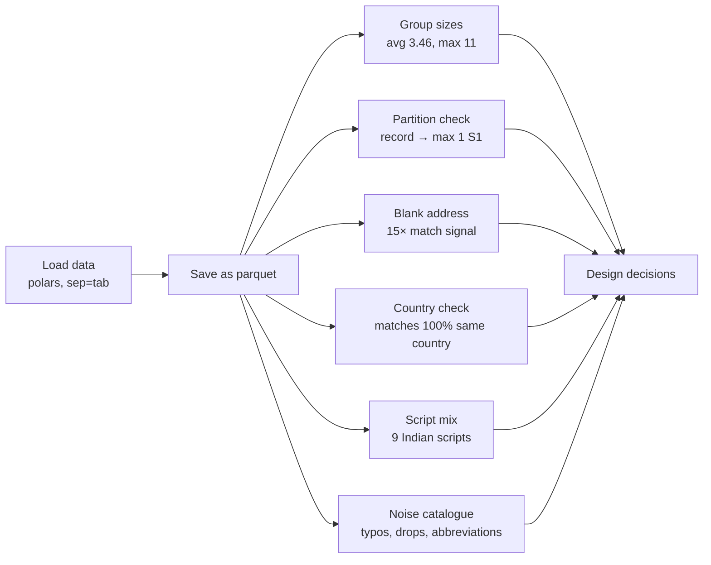
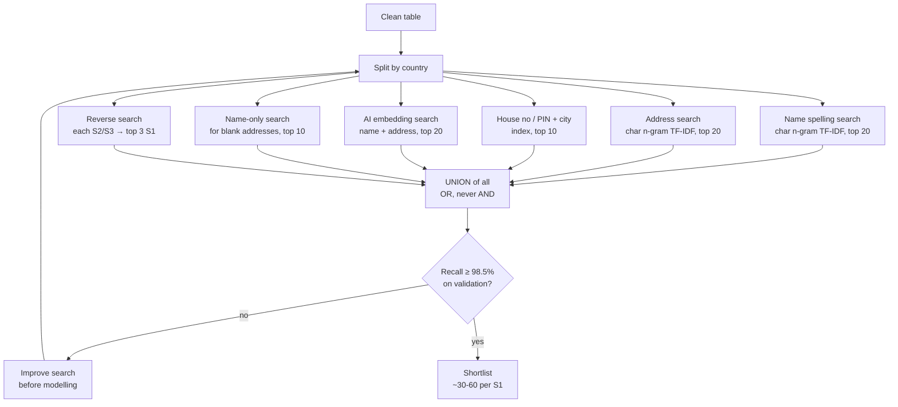
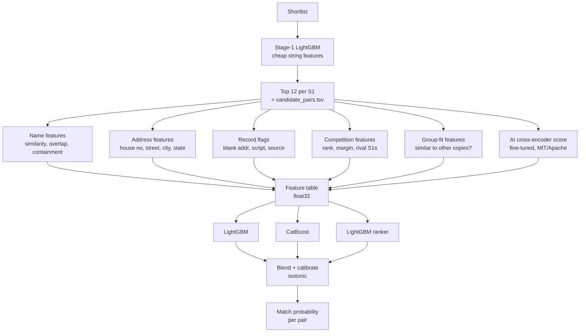
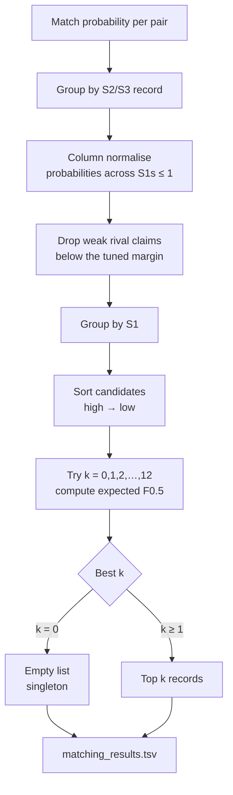
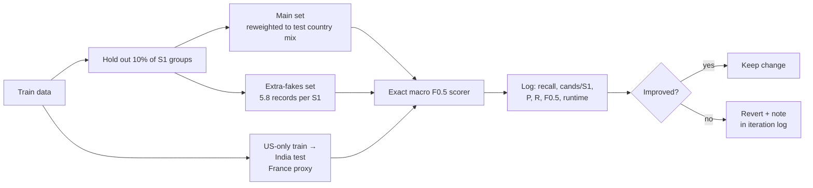
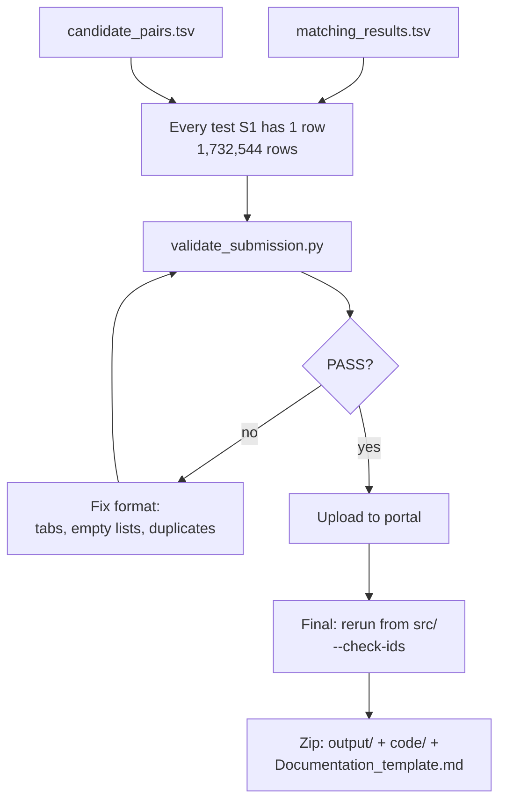

# Pipeline Flowchart — Business Entity Resolution

> Full flow from raw data to the submission zip. Diagrams use Mermaid, which renders on GitHub, in VS Code
> (Markdown Preview Mermaid extension), in Obsidian and in Typora. A plain-text version is at the bottom.

---

## 1. Big picture



---

## 2. EDA (Exploratory Data Analysis)



---

## 3. Preprocessing + transliteration

```mermaid
flowchart TD
    A[Raw name + address] --> B[Keep raw copy<br/>never overwrite]
    A --> C[Lowercase, fix spaces,<br/>remove junk: << -- ()]
    C --> D[Normalise suffixes<br/>Ltd/Limited, Pvt, SARL, SAS]
    C --> E[Normalise address words<br/>Rd→road, St→street, R.→rue]
    C --> F[Space-stripped name<br/>for domain names like abc.com]
    C --> G{Indian script?}
    G -- yes --> H[Word table<br/>learned from train pairs]
    H -- unknown word --> I[IndicXlit<br/>offline model]
    H --> J[name_roman /<br/>address_roman]
    I --> J
    G -- no --> J
    E --> K[Parse address<br/>house no, street, city, state, PIN]
    D & F & J & K --> L[Clean table<br/>raw + normalised columns]
```

---

## 4. Candidate generation (blocking)



---

## 5. Features + models



---

## 6. Decision layer



---

## 7. Validation loop



---

## 8. Output + submission



---

## Plain-text version

```
RAW DATA (S1, S2, S3, ground truth)
   |
   v
EDA ............. group sizes, partition, blank address, country, scripts, noise types
   |
   v
PREPROCESS ...... keep raw | lowercase, junk strip | suffix + address-word normalise
   |              | space-stripped name | parse address
   v
TRANSLITERATE ... Indian script -> word table (from train) -> IndicXlit for unknown words
   |
   v
SPLIT BY COUNTRY  US | India | France
   |
   v
CANDIDATES (OR-union) ... name TF-IDF | address TF-IDF | house no/PIN | AI embedding
   |                       | name-only | reverse (record -> S1)
   |   gate: recall >= 98.5% on validation, else fix here
   v
STAGE-1 LightGBM ........ keep top 12 per S1  ==> candidate_pairs.tsv
   |
   v
FEATURES ....... name | address | record flags | competition | group-fit | AI cross-encoder
   |
   v
STAGE-2 MODELS . LightGBM + CatBoost + ranker -> blend -> calibrate -> probability
   |
   v
SETTLE CONFLICTS  one record -> one S1 (column normalise + margin)
   |
   v
PICK BEST LIST .. per S1, try k = 0..12, keep best expected F0.5 (k = 0 -> empty)
   |
   v
OUTPUT ......... matching_results.tsv -> validate_submission.py -> upload -> zip

VALIDATION (runs alongside): main set | extra-fakes set | US->India set -> exact F0.5 scorer
```
